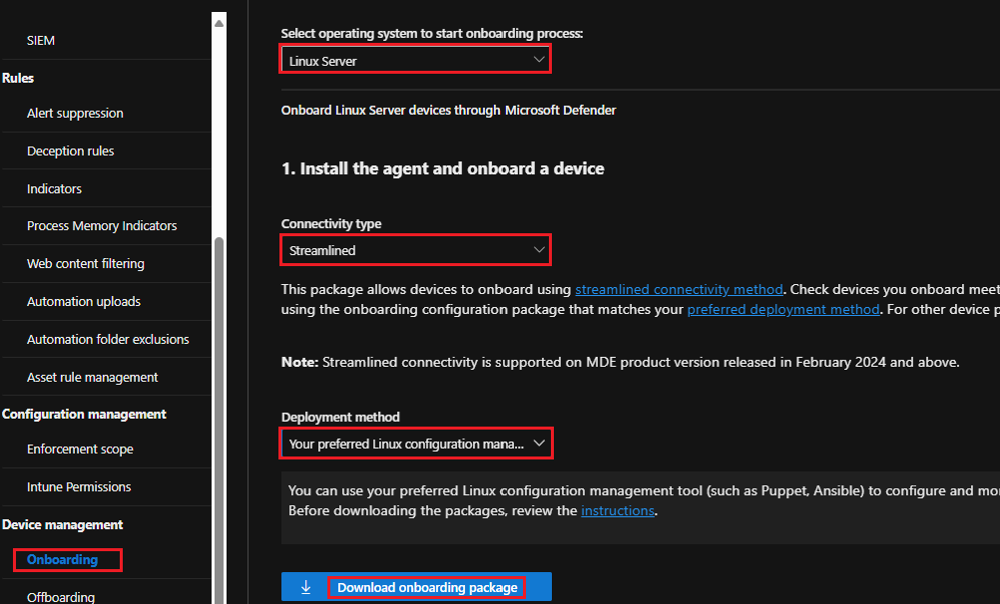

# Deploy MDE on Linux with Ansible

## What is the lab exercise about?
In this exercise, you'll use Ansible to deploy [Defender for Endpoint on Linux devices](https://learn.microsoft.com/en-us/defender-endpoint/linux-install-with-ansible).<br>
You can deploy, configure, and test MDE functionalities on development servers, and then to production servers. The following steps will be covered:<br>
- [Step1: Configuraion Files](https://github.com/coullessi/Microsoft-Defender-for-Endpoint/blob/main/Platforms/Linux/AnsibleOnboarding/README.md#step-1-configuration-files)
- [Step 2: Create SSH keys and install Ansible](https://github.com/coullessi/Microsoft-Defender-for-Endpoint/blob/main/Platforms/Linux/AnsibleOnboarding/README.md#step-2-create-ssh-keys-and-install-ansible)
- [Step 3: Download the onboarding package](https://github.com/coullessi/Microsoft-Defender-for-Endpoint/blob/main/Platforms/Linux/AnsibleOnboarding/README.md#step-3-download-the-onboarding-package)
- [Step 4: Copy files to the remote server](https://github.com/coullessi/Microsoft-Defender-for-Endpoint/blob/main/Platforms/Linux/AnsibleOnboarding/README.md#step-4-copy-files-to-the-remote-server)
- [Step 5: Install mdatp](https://github.com/coullessi/Microsoft-Defender-for-Endpoint/blob/main/Platforms/Linux/AnsibleOnboarding/README.md#step-5-install-mdatp)
- [Step 6: Uninstall mdatp](https://github.com/coullessi/Microsoft-Defender-for-Endpoint/blob/main/Platforms/Linux/AnsibleOnboarding/README.md#step-6-uninstall-mdatp)<br>
To get the most out of this exercise, it's good to have the following knowledge:<br>
- You know how to provision Linux VMs using Hyper-V, Azure, or any other virtualization platform.
- You can configure and exchange communication keys between devices; SSH is correctly configured, and you can transfer files between devices.
- You can find help for the usage of commands by typing ```command_name --help```, or ```man command_name``` to view the full documentation for a command. 
    - In a terminal, type for example ```apt --help``` to get a summary of the available commands and their usage for the Advanced Package Tool (APT), which is a package management system commonly used in Debian-based Linux distributions.
    - Type for example ```man ssh-keygen``` to get the detailed documentation of the command-line utility used for generating, managing, and converting authentication keys for SSH (Secure Shell).
- You can update a system and install applications, for example for a Debian system, run the following:<br>
```sudo apt update && sudo apt upgrade``` to fully update the system.<br>
```sudo apt install unzip``` to install unzip.

## Example of environment
- ```ubta```: control node, prod channel
- ```rhela```: managed node, prod channel
- ```deba```: managed node, prod channel
- ```ubtb```: managed node, insiders-fast channel
- ```rhelb```: managed node, insiders-fast channel

| Ubuntu 22.04-LTS (jammy) | Redhat Linux - RHEL 9 | Debian Linux 11 (bullseye) |
| ---------- | ---------- | ---------- |
| **utba** | **rhela** | **deba**|	
| **ubtb** | **rhelb** | |

:information_source: **Note**: in this lab exercise, you do not need to login as the root user to run commands. Only make sure that the user running the commands is part of the _**sudo**_ group for Debian-based (for example Ubuntu) systems and the _**wheel**_ group for a RedHat Enterprise system.
You need to determine the code for Debian-based systems, you'll need to specify the codename when you add the repositories for 'mdatp' to your configuration file 'add_mdatp_repo.yml'. Run ```lsb_release -a``` to find the codename: in this lab, the codename is jammy for Ubuntu 22.04 and bullseye for Debian 11.
One of the VM will be the ansible control node and all other VMs will be the managed nodes, refer to the table of devices above.
Make sure unzip is installed on all managed nodes (Linux VMs that you need to onboard to MDE), for example:<br>
<br>
***Ubuntu***: ```sudo apt install unzip```<br>
***RedHat***: ```sudo yum install unzip```
<hr>

## Step 1: Configuration files
In addition to the downloaded onboarding package from the [Defender portal](https://security.microsoft.com/securitysettings/endpoints), use your favorite editor (Visual Studio code - that's what I use) to update the hosts, add_mdatp_repo.yml, onboarding_setup.yml, and install_mdatp.yml files.<br>

- [Control node configuration file](./Assets/config_controlnode.sh): bash script to configure Ansible and other settings on the control node.<br>
- [MDE setup](./Assets/onboarding_setup.yml): this file is referenced by Ansible to register the ```mdatp_onboard.json``` onboarding package.<br>
- [List of devices](./Assets/hosts): this file contains the list of ```prod``` and ```dev``` devices to be onboarded to MDE.<br>
- [Prod repositories](./Assets/prod_mdatp_repo.yml): in this file, the MDE repositories for the ```prod channel```are specified.<br>
- [Dev repositories](./Assets/dev_mdatp_repo.yml): in this file, the MDE repositories for the ```insiders-fast channel```are specified.<br>
- [Prod MDE install](./Assets/prod_install_mdatp.yml): this file is referenced by Ansible to install MDE on a ```prod device```.<br>
- [Dev MDE install](./Assets/dev_install_mdatp.yml): this file is referenced by Ansible to install MDE on a ```dev device```.<br>
- [MDE uninstall](./Assets/uninstall_mdatp.yml): this file is referenced by Ansible to uninstall MDE on a device.<br>

## Step 2: Create SSH keys and install Ansible
The assumption is that the files and keys do not exist, you'll need to create them then.
Create a private/public key pair on the Ansible control node that you'll use to automate tasks. 
The command ```ssh-keygen -t rsa -C "ControlNode" -f ~/.ssh/ControlNodeKey``` will generate a private/public key pair and store them in the ControlNodeKey and ControlNodeKey.pub files respectively.
You may also need to create the the know_hosts and known_hosts.old files on the devices if they do not exist. The ```known_hosts``` and ```known_hosts.old``` files are related to SSH (Secure Shell) and play a crucial role in verifying the identity of remote servers before establishing a connection. 
The known_hosts file stores the public keys of servers that you have connected to using SSH.
The known_hosts.old file is a backup of the known_hosts file.<br>

- ```Control Node``` and ```Managed Nodes```: Create the ```.ssh``` directory and the ```authorized_keys``` file under the .ssh directory, if they do not exist.
```bash 
# Create the .ssh directory
mkdir ~/.ssh 
# Create the authorized_keys file
touch ~/.ssh/authorized_keys   
```

- ```Control Node``` and ```Managed Nodes```: Create the ```known_hosts``` and the ```known_hosts.old``` files if they do not exist.
```bash
# Create the known_hosts and known_hosts.old files.
sudo touch ~/.ssh/known_hosts ~/.ssh/known_hosts.old
# Make the user (in this case lessi) who will onboard the servers to MDE both the owner and group of the files.
sudo chown lessi:lessi ~/.ssh/known_hosts ~/.ssh/known_hosts.old 
```

- ```Control Node```: Generate SSH keys
```bash
# Generate a private/public key pair
ssh-keygen -t rsa -C "ControlNode" -f ~/.ssh/ControlNodeKey

# Create the config file if doesn't alredy exist and
# add the following line: IdentityFile ~/.ssh/ControlNodeKey, save the file.
sudo vim ~/.ssh/config 

# List the content of the .ssh file. You'll have the following: config, ControlNodeKey, ControlNodeKey.pub
ls ~/.ssh/

# Display the value of the public key, copy it, you will add it to the ~/.ssh/authorized_keys file on the managed nodes.
cat ~/.ssh/ControlNodeKey.pub
```
Paste the value of the public key copied from the control node to the ```~/.ssh/authorized_keys``` file of the managed nodes.<br>

- Install Ansible on the ```control node``` (example of Ubuntu device)
```bash
sudo apt update
sudo apt install pipx
pipx ensurepath
sudo pipx ensurepath --global
	
pipx install --include-deps ansible
pipx ensurepath
pipx upgrade --include-injected ansible
pipx inject ansible argcomplete
pipx inject --include-apps ansible argcomplete
activate-global-python-argcomplete --user
sudo pipx ensurepath
```
Ansible installed successfully, type 'exit' to exit the shell.
Start a new shell and run ```ansible --version``` to check the version of ansible installed.

All the above commands used to configure the ```control node``` are also supplied in the [config_controlnode.sh](../../Assets/config_controlnode.sh) file. You can run that file once to generate the SSH keys and install Ansible.

Once Ansible is installed, log out and log back into the system.

## Step 3: Download the onboarding package
Go to ```security.microsoft.com > Settings > Endpoints > Onboarding``` and select the following:
- Operation system: ```Linux Server```
- Connectivity type: ```Streamlined```
- Deployment method: ```Your preferred Linux configuration management tool```
- Click: ```Download onboarding package```.<br>


## Step 4: Copy files to the remote server
In the example below, the ```scp``` command copies all files from the source folder to the destination directory on the ```control node``` (the destination directory will be created if it doesn't exist):
- ```scp```: the command for a secure copy over SSH.
- ```port_number```: the port where the remote server is listening for incoming SSH requests.
- ```ssh_private_key```: location of the ssh private key; if you do not have a key configure, you can provide a password when prompted. 
- ```source_folder```: folder containing files to be transferred. 
- ```destination_directory```: Remote server directory where files will be transferred, in the form of ```user@domain.com:~/directory``` or ```user@ip_address:~/directory```

**Example of command**: ```scp -P [port_number] -i [ssh_private_key] -r [source_folder] [destination_directory]```. Replace all items in square brackets ```[]``` with their corresponding values.<br>
On the Linux Server, run the ```ls [destination_directory]``` to verify that all files are copied from your local system to the Ansible control node.

## Step 5: Install mdatp
You'll install ```mdatp``` on ```production servers```. Verify that you can communicate with all ansible nodes that you want to onboard by running ```ansible -i hosts prod -m ping``` where ```hosts``` is the list of all your managed nodes and ```prod``` the group of production devices within that list. Make sure you have a "SUCCESS" for all pings and that python3 is discovered.
Then run  ```ansible -K prod_install_mdatp.yml -i hosts``` to install MDE on your list of devices.<br>
:bulb: **Tip:** You may also run ```ansible -i hosts all -m ping``` or ```ansible -i hosts prod:dev -m ping``` to test connectivity with all devices (prod & dev servers): 
```bash
# Make sure all servers can be reached
ansible -i hosts prod -m ping
# Run the playbook to install mdatp
ansible-playbook -K prod_install_mdatp.yml -i hosts prod
```
To install ```mdatp``` on dev servers, run the following instead:
```bash
ansible -i hosts dev -m ping
ansible-playbook -K dev_install_mdatp.yml -i hosts dev
```

:information_source: **Note**: Verify the list of onboarded devices from the Defender portal
You should end up with a list of devices after the devices are managed by MDE. Allow up to 24 hours for devices to be managed by MDE.

Configure endpoint security policies for your newly onboarded devices

Verify the onboarding status on a device and notice that the device is managed by MDE
Run the following command: ```mdatp health | grep -i 'managed\|managed_by\|MDE'```.

Run a threat detection test
Run the following commands, for example from the home directory: 
<br>```curl -o eicar.com.txt "https://secure.eicar.org/eicar.com.txt"``` to donwnload the eicar file.
<br>Run ``ls`` and notice that the downloaded file does not exist; it has been quarantined.
<br>Run ```mdatp threat list``` to view the list of threat found, also notice the quarantined status.You'll also be able to view the correponding alert/incident from the Defender portal.

## Step 6: Uninstall mdatp
:exclamation: **Important**: Do not run this unless you want to remove MDE on devices.
Just in case you want to remove mdatp from devices and offboard them from a tenant.
```bash
ansible -i hosts all -m ping
ansible-playbook -K uninstall_mdatp.yml -i hosts
```
<br>
<hr>

[](https://www.linkedin.com/in/c-lessi/)
[](https://www.youtube.com/channel/UCk8wUhDaJ6pnP_1G5ugrQ1A)