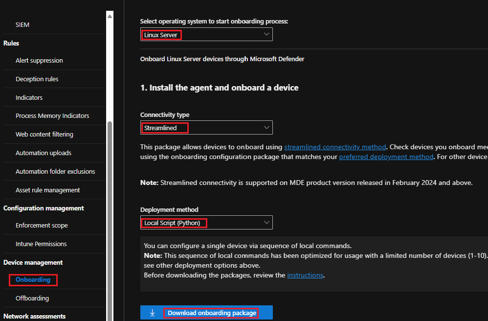

# Deploy MDE on Linux Manually

## What is the lab exercise about?
In this exercise, you'll [onboard](https://learn.microsoft.com/en-us/defender-endpoint/linux-install-manually) a RedHat Enterprise Linux device to Microsoft Defender for Endpoint.<br> 
The following steps are covered:
- [Step 1: Connect to the server](https://github.com/coullessi/Microsoft-Defender-for-Endpoint/blob/main/Platforms/Linux/ManualOnboarding/README.md#step-1-connect-to-the-server)
- [Step 2: Update the server](https://github.com/coullessi/Microsoft-Defender-for-Endpoint/blob/main/Platforms/Linux/ManualOnboarding/README.md#step-2-update-the-server)
- [Step 3: Create a user](https://github.com/coullessi/Microsoft-Defender-for-Endpoint/blob/main/Platforms/Linux/ManualOnboarding/README.md#step-3-create-a-user)
- [Step 4: Download the onboarding package](https://github.com/coullessi/Microsoft-Defender-for-Endpoint/blob/main/Platforms/Linux/ManualOnboarding/README.md#step-4-download-the-onboarding-package)
- [Step 5: Transfer the onboarding package to the Linux machine](https://github.com/coullessi/Microsoft-Defender-for-Endpoint/blob/main/Platforms/Linux/ManualOnboarding/README.md#step-5-transfer-the-onboarding-package-to-the-linux-machine)
- [Step 6: Install MDE](https://github.com/coullessi/Microsoft-Defender-for-Endpoint/blob/main/Platforms/Linux/ManualOnboarding/README.md#step-6-install-mde)
- [Step 7: Onboard the server to MDE](https://github.com/coullessi/Microsoft-Defender-for-Endpoint/blob/main/Platforms/Linux/ManualOnboarding/README.md#step-7-onboard-the-server-to-mde)

## Step 1: Connect to the server
From a terminal session, connect to a Linux VM using the command: ```ssh user@ip_address``` or ```ssh user@ip_address -p port_number``` if you are connecting to a port other then TCP port 22.<br>

:bulb: **Tip:** The ```IP address``` can also be the ```FQDN``` of the server you are connecting to.<br>
Example of command
```bash
# Connect using an IP address
ssh bob@10.0.0.10
# If you need to specify a port number
ssh bob@10.0.0.10 -p 2222
```
:bulb: **Tip:** This is not needed, but you can use certificate-based authentication, so that you don't have to enter a password when you connect.
  

## Step 2: Update the server
```bash
sudo yum update && sudo yum upgrade
```

## Step 3: Create a user 
The user will be added the user to the 'wheel' group, so the user can manage the server. This step is not really needed. But this is to avoid login onto the server as root. You can create a user with multiple lines of commands or a single line of command.

```bash
# Switch to the root user
sudo -i

# Create the user and set the user's home directory with '-m'
adduser -m bob

# Configure the user's password
passwd bob

# Add the user to the 'wheel' (sudo) group
usermod -aG wheel bob

# Verify the user belongs to the 'wheel' group
id bob

# Login as the new user
su - bob
```
or

 ```bash
 # Single line to create a user
 sudo useradd -m bob && sudo passwd bob && sudo usermod -aG wheel bob
 ```
Now, you can connect to your Linux device using the new user's (bob) credentials:
```bash
ssh bob@ip_address
```

## Step 4: Download the onboarding package
Go to ```security.microsoft.com > Settings > Endpoints > Onboarding``` and select the following:
- Operation system: ```Linux Server```
- Connectivity type: ```Streamlined```
- Deployment method: ```Local Script (Python)```
- Click: ```Download onboarding package```.<br>



## Step 5: Transfer the onboarding package to the Linux machine 
In Linux, we can share files between computers using scp. scp utilizes ssh to securely transfer files. We use the following syntax to copy files from the source machine to the destination machine: ```scp <path_to_local_file> username@ip_address:<path_to_destination>```, for example the below command will copy the onboarding package from your local computer into the MDE directory of the Linux device.
```PowerShell
 scp GatewayWindowsDefenderATPOnboardingPackage.zip user@10.0.0.10:~/MDE
```  

On the Linux machine, unzip the onboarding package (you may need to install ```unzip```). You'll get the MicrosoftDefenderATPOnboardingLinuxServer.py file.
```bash
unzip GatewayWindowsDefenderATPOnboardingPackage.zip
```
This will give you the ```MicrosoftDefenderATPOnboardingLinuxServer.py``` file.<br>
Initially the client device is not associated with an organization and the ```org_id``` attribute is blank.
```bash
mdatp health --field org_id
``` 

Verify python3 is installed, if not install it
```bash
python3 --version
```

## Step 6: Install MDE
[RHEL and variants](https://learn.microsoft.com/en-us/microsoft-365/security/defender-endpoint/linux-install-manually?view=o365-worldwide#rhel-and-variants-centos-fedora-oracle-linux-amazon-linux-2-rocky-and-alma)
Use ```hostnamectl``` command to identify system related information including distribution and release version.
Install yum-utils if it isn't already installed: 
```bash
sudo yum install yum-utils
```
Add the repositories to your list of packages (Rhel 9.0 from the prod and insiders-fast channels)
```bash
sudo yum-config-manager --add-repo=https://packages.microsoft.com/config/rhel/9.0/prod.repo
sudo yum-config-manager --add-repo=https://packages.microsoft.com/config/rhel/9.0/insiders-fast.repo
```
Install the Microsoft GPG public key
```bash
sudo rpm --import https://packages.microsoft.com/keys/microsoft.asc
```
Application installation - list all existing repositories
```bash
yum repolist
```
 If you have multiple Microsoft repositories, to install the package from the production channel for example, use the following command.
 ```bash 
 sudo yum --enablerepo=packages-microsoft-com-prod install mdatp
 ```
 Set the device tag
 ```bash
 sudo mdatp edr tag set --name GROUP --value 'MDE-Management'
 ```        

## Step 7: Onboard the server to MDE
Run ```MicrosoftDefenderATPOnboardingLinuxServer.py``` to onboard the Linux Server.
```bash
sudo python3 MicrosoftDefenderATPOnboardingLinuxServer.py
```
 Verify that the device is now associated with your organization and reports a valid organization identifier.
```bash
mdatp health --field org_id
```
Check the health status of the product. A return value of ```true``` denotes that the product is functioning as expected.
```bash
mdatp health --field healthy
```    
Check the status of the definition update, return value should be ```up_to_date```.
```bash
mdatp health --field definitions_status
```
Ensure real-time protection is enabled, the return value should be ```true```.
```bash
mdatp health --field real_time_protection_enabled
```
If not, run the following: 
```bash
sudo mdatp config real-time-protection --value enabled
```
Test MDE on Linux by simulating the download of the ```eicar``` [file](https://www.eicar.org/download-anti-malware-testfile/). The file should be quarantined.
```bash
curl -o ~/eicar.com.txt https://secure.eicar.org/eicar.com.txt
```
List the detected threats
```bash
mdatp threat list
``` 

## Step 8: Configure MDE
- In Microsoft Entra ID, create a device group chosing the [Dynamic Device](https://learn.microsoft.com/en-us/entra/identity/users/groups-dynamic-membership#rules-for-devices) as membership type. 
- [Set preferences for MDE](https://learn.microsoft.com/en-us/defender-endpoint/linux-preferences) on your Linux device.

<br>

## Documentation
[Microsoft Defender for Endpoint on Linux](https://learn.microsoft.com/en-us/defender-endpoint/microsoft-defender-endpoint-linux)<br>
[Install Microsoft Defender for Endpoint Manually](https://learn.microsoft.com/en-us/defender-endpoint/linux-install-manually)

<br>
<hr>

[](https://www.linkedin.com/in/c-lessi/)
[](https://www.youtube.com/channel/UCk8wUhDaJ6pnP_1G5ugrQ1A)