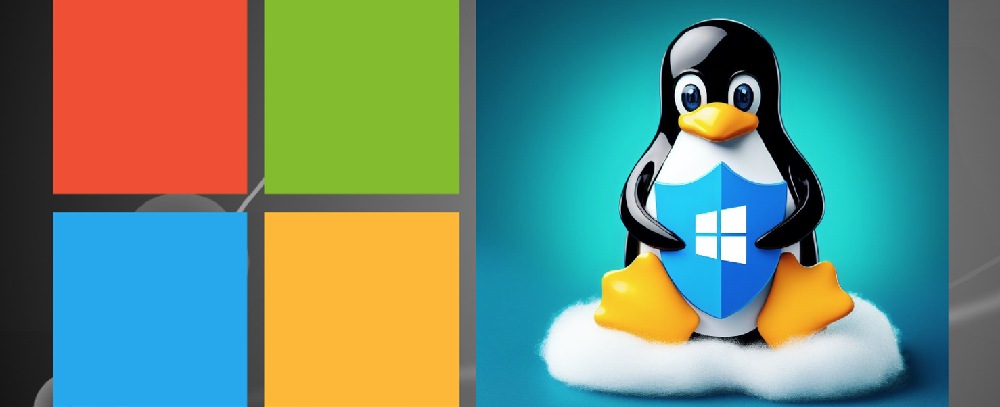

# Microsoft Defender for Endpoint on Linux

## Introduction
:memo:**What this lab IS / IS NOT about**<br>

**This lab is not about** teaching you the administration of a Linux device.<br>
**This lab is about** providing you steps to ramp up with onboarding Microsoft Defender for Endpoint (MDE) on Linux. 
This lab exercise will also walk you through configuring MDE features and capabilities. Using a profile, you will configure MDE preferences (which take precedence over the ones set locally a the device). In other words, users in the enterprise will not be able to change preferences that are set through the configuration profile.

> [!Note]
In this lab I use ```vim``` and ```Visual Studio Code``` to edit files. You can use your favorite text editor.


## Prerequisites
- Create Linux virtual machines using [Hyper-V](https://learn.microsoft.com/en-us/windows-server/virtualization/hyper-v/get-started/create-a-virtual-machine-in-hyper-v?tabs=hyper-v-manager#create-a-virtual-machine), [Microsoft Azure](https://learn.microsoft.com/en-us/azure/virtual-machines/linux/quick-create-portal?tabs=ubuntu), [Amazon Web Services - AWS](https://aws.amazon.com/getting-started/launch-a-virtual-machine-B-0/). etc.
- Create Microsoft Entra ID ```Dynamic Device``` group.
- Access to the Microsoft Defender, Microsoft Intune, and Microsoft Entra ID portals.
- Ensure that you have a Microsoft Defender for Endpoint subscription.
- Linux distribution using the **_systemd_** system manager.
- Beginner-level experience in Linux and BASH scripting.
- Administrative privileges on the Linux device.

## Deployment methods
In this lab exercise, you'll install and configure Microsoft Defender for Endpoint on Linux devices using one of the following deployment methods:
| Deployment Methods | Recordings |
| ------------- | ------------- |
| [Deploy MDE on Linux Manually](./ManualOnboarding/README.md) | [Video](https://youtu.be/KpuICweyksE) |
| [Deploy MDE on Linux with a Script](./ScriptOnboarding/README.md) | [Video](https://youtu.be/8qWkkeXAHaE) |
| [Deploy MDE on Linux with Ansible](./AnsibleOnboarding/README.md) | [Video](https://youtu.be/v_7pNHLgcaE) |

The video playlist of all deployment methods can be found [here](https://m.youtube.com/playlist?list=PLDI76x8X-DfZidrncAefib3a951rVwfFY).<br><br>
>[!Note]
For testing purposes, evaluating Microsoft Defender for Endpoint detection and remediation capability, after ```real-time protection``` is configured (set to true), we are going to [download the anti-malware](https://www.eicar.org/download-anti-malware-testfile/) ```eicar``` test file. It will be flagged as malicious (this is not a malicious file) and quarantined.
<br><br>

## Reference documents
[Deploy Microsoft Defender for Endpoint on Linux manually](https://learn.microsoft.com/en-us/microsoft-365/security/defender-endpoint/linux-install-manually?view=o365-worldwide)<br>
[Deploy Microsoft Defender for Endpoint on Linux with a Script](https://learn.microsoft.com/en-us/microsoft-365/security/defender-endpoint/linux-install-manually?view=o365-worldwide#installer-script)<br>
[Deploy Microsoft Defender for Endpoint on Linux with Ansible](https://learn.microsoft.com/en-us/microsoft-365/security/defender-endpoint/linux-install-with-ansible?view=o365-worldwide)<br>
[Install Ansible - Ansible Documentation](https://docs.ansible.com/ansible/latest/installation_guide/intro_installation.html)<br>

<br>
<hr>

[](https://www.linkedin.com/in/c-lessi/)
[](https://m.youtube.com/playlist?list=PLDI76x8X-DfZidrncAefib3a951rVwfFY)
