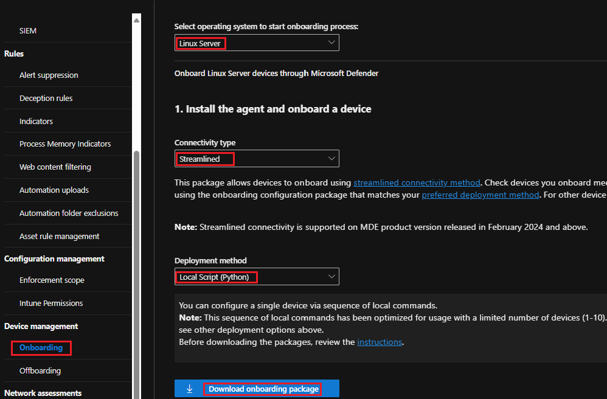

# Deploy MDE on Linux with a Script

## What is the lab exercise about?
In this exercise, you'll use an [automated script](https://learn.microsoft.com/en-us/defender-endpoint/linux-install-manually#installer-script) to onboard a device to Microsoft Defender for Endpoint. The script identifies the distribution and version, simplifies the selection of the right repository, sets up the device to pull the latest package, and combines the product installation and onboarding steps.<br>
The following steps are covered:
- [Step 1: Download the onboarding package](https://github.com/coullessi/Microsoft-Defender-for-Endpoint/blob/main/Platforms/Linux/ScriptOnboarding/README.md#step-1-download-the-onboarding-package)
- [Step 2: Copy files to the server to onboard](https://github.com/coullessi/Microsoft-Defender-for-Endpoint/blob/main/Platforms/Linux/ScriptOnboarding/README.md#step-2-copy-files-to-the-server-to-onboard)
- [Step 3: Install MDE](https://github.com/coullessi/Microsoft-Defender-for-Endpoint/blob/main/Platforms/Linux/ScriptOnboarding/README.md#step-3-install-mde)
- [Step 4: Uninstall MDE](https://github.com/coullessi/Microsoft-Defender-for-Endpoint/blob/main/Platforms/Linux/ScriptOnboarding/README.md#step-4-uninstall-mde)

## Step 1: Download the onboarding package
Go to ```security.microsoft.com > Settings > Endpoints > Onboarding``` and select the following:
- Operation system: ```Linux Server```
- Connectivity type: ```Streamlined```
- Deployment method: ```Local Script (Python)```
- Click: ```Download onboarding package```.<br>


## Step 2: Copy files to the server to onboard
Use the ```scp``` command to copy files from your local system to the Linux server. For example,<br>
```scp .\GatewayWindowsDefenderATPOnboardingPackage.zip lessi@10.0.0.125:~/``` to copy the onboarding package to the user's home directory.<br>
```scp .\install_mde.sh lessi@10.0.0.125:~/``` to copy the installer bash script to the user's home directory.<br>
On the Linux server, run ```chmod +x install_mde.sh``` to turn the installer file into an executable.
```bash
chmod +x install_mde.sh
```

## Step 3: Install MDE
Make sure ```unzip``` is installed on the server you are going to onboard. If not, run ```sudo yum install unzip``` to install unzip.<br>
Intead of running the onboarding commands individually, you can run the [bash script](install_mde.sh) to onboard your server. 
```bash
sudo ./install_mde.sh
```
If you rather like to run the commands one by one, use the 3 commands below. 
```bash
curl -o mde_installer.sh https://raw.githubusercontent.com/microsoft/mdatp-xplat/master/linux/installation/mde_installer.sh
sudo unzip GatewayWindowsDefenderATPOnboardingPackage.zip
sudo chmod +x ./mde_installer.sh
sudo ./mde_installer.sh --install --channel prod --onboard MicrosoftDefenderATPOnboardingLinuxServer.py --tag GROUP "RedHat-Linux" --min_req -y
```
- **Test MDE detection and remediation capability: download the eicar file**<br>
MDE will detect an attempt to download the eicar file and quarantine the file.
```bash
mdatp health --field definitions_status
sudo mdatp config real-time-protection --value enabled
curl -o ~/eicar.com.txt https://secure.eicar.org/eicar.com.txt
```
- **Verify the file is quarantined**
```bash
mdatp threat list
```
- ### Verification in the portal
    - Verify the device is present in the MDE portal
    - Verify the tag is set
    - Verify the alert on the attempt of the eicar file download


## Step 4: Uninstall MDE
Download the ```offboarding package``` from the Defender portal.<br>
:exclamation: Before you run the command below, replace ```offboarding_package``` with the package you downloaded from your Defender portal.
```bash
sudo ./mde_installer.sh --remove --onboard [offboarding_package]
```
<br>

## Documentation
[Microsoft Defender for Endpoint on Linux](https://learn.microsoft.com/en-us/defender-endpoint/microsoft-defender-endpoint-linux)<br>
[Install Microsoft Defender for Endpoint with an Automated Script](https://learn.microsoft.com/en-us/defender-endpoint/linux-install-manually#installer-script)

<br>
<hr>

[](https://www.linkedin.com/in/c-lessi/)
[](https://www.youtube.com/channel/UCk8wUhDaJ6pnP_1G5ugrQ1A)