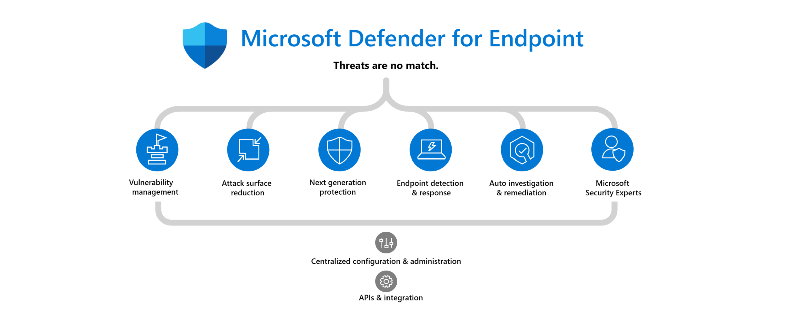

# Microsoft Defender for Endpoint Deployment Lab
Microsoft Defender for Endpoint is an enterprise endpoint security platform designed to help enterprise networks prevent, detect, investigate, and respond to advanced threats. 
Defender for Endpoint is a primary component of the **Assume breach** principle and an important element of your extended detection and response (XDR) deployment with Microsoft Defender XDR. 
Defender for Endpoint uses **endpoint behavioral sensors**, **cloud security analytics**, and **threat intelligence** to form with other security solutions a unified pre-breach and post-breach enterprise defense suite for Microsoft Defender XDR. This native integration across endpoints, identity, email, and applications allows you to detect, prevent, investigate, and automatically respond to sophisticated attacks.

## Deploy Microsoft Defender for Endpoint
In this lab exercise, you'll install and configure Microsoft Defender for Endpoint on Windows and Linux Devices.
- [Deploy MDE on Windows](./Platforms/Windows/README.md)
- [Deploy MDE on Linux](./Platforms/Linux/README.md)

## Reference Documents
[Deploy Microsoft Defender for Endpoint on Windows](https://learn.microsoft.com/en-us/defender-endpoint/mde-planning-guide) 
[Deploy Microsoft Defender for Endpoint on Linux](https://learn.microsoft.com/en-us/defender-endpoint/microsoft-defender-endpoint-linux)