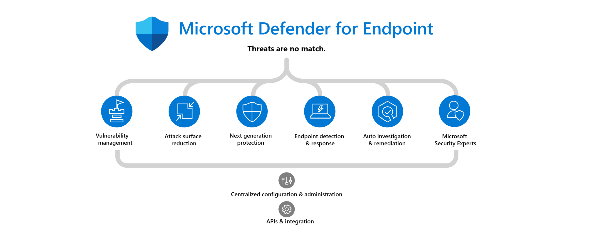

<base target="_blank">



# Microsoft Defender for Endpoint - Lab
Microsoft Defender for Endpoint, an enterprise endpoint security platform, is a primary component of the **assume breach** concept and an important element of your extended detection and response (XDR) deployment with [Microsoft Defender XDR](https://learn.microsoft.com/en-us/defender-xdr/microsoft-365-defender).<br>
Defender for Endpoint uses **endpoint behavioral sensors**, **cloud security analytics**, and **threat intelligence** to form with other security solutions,```Microsoft Defender for Identity```, ```Microsoft Defender for Office 365```, and  ```Microsoft Defender for Cloud Apps``` a unified pre-breach and post-breach enterprise defense suite for Microsoft Defender XDR. This native integration across endpoints, identity, email, and applications allows you to prevent, detect, investigate, and automatically respond to sophisticated attacks.

## Deploy Microsoft Defender for Endpoint
In this lab exercise, you'll install and configure Microsoft Defender for Endpoint on Windows and Linux Devices.<br>
- [Deployment Lab: MDE on Linux](./Platforms/Linux/README.md)

Defender for Endpoint on ```Windows```, ```macOS```, ```iOS```, and ```Android``` is not yet part of the lab exercise.
- ~~[Deployment Lab: MDE on Windows](./Platforms/Windows/README.md)~~: Coming soon...
- ~~[Deployment Lab: MDE on macOS](./Platforms/macOS/README.md)~~: Coming soon...
- ~~[Deployment Lab: MDE on iOS](./Platforms/iOS/README.md)~~: Coming soon...
- ~~[Deployment Lab: MDE on Android](./Platforms/Android/README.md)~~: Coming soon...

<br>

## Reference Documents
[Deploy Microsoft Defender for Endpoint on Windows](https://learn.microsoft.com/en-us/defender-endpoint/mde-planning-guide)<br>
[Deploy Microsoft Defender for Endpoint on Linux](https://learn.microsoft.com/en-us/defender-endpoint/microsoft-defender-endpoint-linux)<br>
[Deploy Microsoft Defender for Endpoint on macOS](https://learn.microsoft.com/en-us/defender-endpoint/microsoft-defender-endpoint-mac)<br>
[Deploy Microsoft Defender for Endpoint on iOS](https://learn.microsoft.com/en-us/defender-endpoint/microsoft-defender-endpoint-ios)<br>
[Deploy Microsoft Defender for Endpoint on Android](https://learn.microsoft.com/en-us/defender-endpoint/microsoft-defender-endpoint-android)

<br>
<hr>

[](https://www.linkedin.com/in/c-lessi/)
[](https://www.youtube.com/channel/UCk8wUhDaJ6pnP_1G5ugrQ1A)
